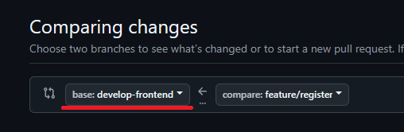

# Guía de Trabajo con Git y GitHub

Esta guía describe el flujo de trabajo recomendado para el desarrollo de nuevas funcionalidades en nuestro proyecto, utilizando Git y GitHub. Cada integrante deberá crear una rama para cada nueva funcionalidad en la que trabaje, a partir de la rama `develop-frontend`.

## 1. Crear una Rama para una Nueva Funcionalidad

Para comenzar a trabajar en una nueva funcionalidad, sigue estos pasos:

1. **Actualizar la Rama Principal Local (`develop-frontend`):**

   Antes de crear una nueva rama, asegúrate de que tu rama `develop-frontend` local esté actualizada con la versión más reciente del repositorio remoto:

   ```bash
   git checkout develop-frontend
   git pull origin develop-frontend
   ```

2. **Crear una Nueva Rama a partir de `develop-frontend`:**

   Usa el siguiente formato para nombrar tu rama: `frontend-feature/nombre-de-la-funcionalidad`. Por ejemplo, si estás trabajando en una funcionalidad de búsqueda, la rama se podría llamar `frontend-feature/search`.

   ```bash
   git checkout -b frontend-feature/nombre-de-la-funcionalidad
   ```

## 2. Trabajar en la Nueva Rama

Realiza los cambios necesarios en tu rama de funcionalidad. Recuerda hacer commits pequeños y específicos cada vez que completes una parte o un avance significativo del trabajo.

### Buenas Prácticas de Commits

- Haz commits lo más individuales posibles para cada cambio o avance.
- Escribe los mensajes de commit en **inglés** y utiliza prefijos que sigan las convenciones estándar, como:

  - **`feat`**: Para una nueva funcionalidad o característica.  
    Ejemplo: `git commit -m "feat: add search component for products"`
  - **`fix`**: Para correcciones de bugs.  
    Ejemplo: `git commit -m "fix: correct button alignment on mobile view"`
  - **`style`**: Para cambios relacionados con el estilo o formato (sin afectar la lógica del código).  
    Ejemplo: `git commit -m "style: update CSS for header"`
  - **`refactor`**: Para refactorización de código sin cambios funcionales ni corrección de errores.  
    Ejemplo: `git commit -m "refactor: simplify user authentication logic"`
  - **`docs`**: Para cambios en la documentación.  
    Ejemplo: `git commit -m "docs: update README with setup instructions"`
  - **`test`**: Para agregar o modificar pruebas.  
    Ejemplo: `git commit -m "test: add unit tests for login component"`
  - **`chore`**: Para tareas de mantenimiento o cambios que no afectan el código fuente o las pruebas.  
    Ejemplo: `git commit -m "chore: update dependencies"`

- Utiliza mensajes de commit claros y concisos que expliquen el "qué" y "por qué" del cambio.

Con estas directrices, se promoverá un uso consistente y claro de los mensajes de commit en el repositorio.

Tambien puede leer mas en: <a href="https://dev.to/achamorro_dev/conventional-commits-que-es-y-por-que-deberias-empezar-a-utilizarlo-23an">Conventional commits que es y por que deberias empezar a utilizarlo</a>

## 3. Realizar un Pull Request (PR)

Una vez que hayas completado la funcionalidad y probado que funciona correctamente, realiza un Pull Request (PR) para fusionar tu rama de funcionalidad con la rama `develop-frontend`.

1. **Subir la Rama al Repositorio Remoto:**

   ```bash
   git push origin frontend-feature/nombre-de-la-funcionalidad
   ```

2. **Crear el Pull Request en GitHub:**

   - Ve al repositorio en GitHub.
   - Selecciona tu rama `frontend-feature/nombre-de-la-funcionalidad`.
   - Haz clic en el botón "Compare & pull request".
   - Asegúrate de que el PR está dirigido a la rama `develop-frontend`.
   - 
   - Agrega una descripción clara de los cambios realizados y de la funcionalidad implementada.

## 4. Fusionar el Pull Request (Merge)

- **Auto-Merge:** Si no hay conflictos, puedes realizar el merge tú mismo.
- **Conflictos:** En caso de conflictos, intenta resolverlos localmente. Si no estás seguro de cómo resolver un conflicto, consulta con los demás integrantes del equipo antes de proceder con el merge.

### Resolución de Conflictos

1. Actualiza tu rama con los últimos cambios de `develop-frontend`:

   ```bash
   git checkout frontend-feature/nombre-de-la-funcionalidad
   git pull origin develop-frontend
   ```

2. Resuelve los conflictos en tu entorno local.
3. Una vez resueltos, realiza un commit de los cambios y empuja tu rama de nuevo al repositorio remoto:

   ```bash
   git add .
   git commit -m "Resolver conflictos con develop-frontend"
   git push origin frontend-feature/nombre-de-la-funcionalidad
   ```

## 5. Buenas Prácticas Generales

- Siempre trabaja en una rama de funcionalidad separada de `develop-frontend`.
- Mantén tu rama `develop-frontend` actualizada.
- Haz commits pequeños y frecuentes.
- Realiza un Pull Request con la funcionalidad.
- Consulta con el equipo si tienes dudas o conflictos.

---

Siguiendo estos pasos, aseguraremos un flujo de trabajo ordenado y eficiente para el desarrollo de nuevas funcionalidades.
